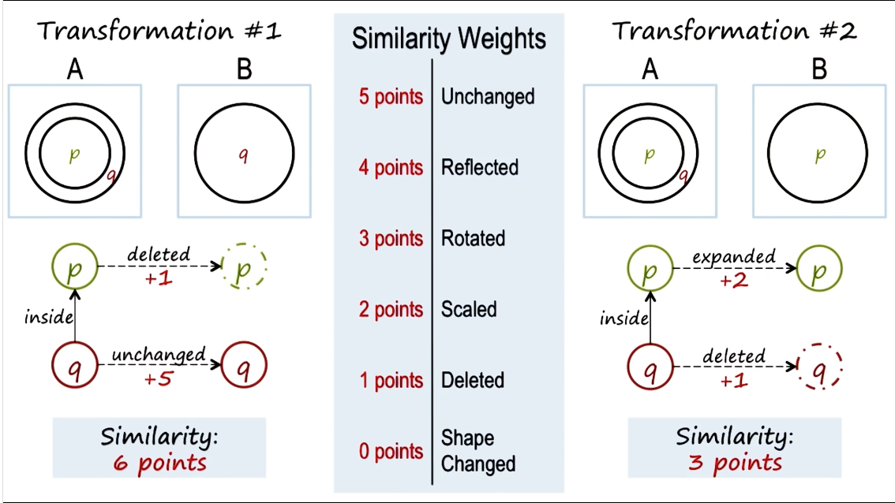

# Lesson 3

In this lesson we will be covering the following topics:

- Knowledge representations
- Semantic networks
- Problem solving with semantic networks
- Represent and reason: represent the knowledge, represent the problem and use the knowledge to address the problem

## Representations

Knowledge of representation has two elements:

1. The language: has a vocabulary
2. The content: knowledge

- E.g., `F = m*a` is an algebraic equation representing Newton's second law.
- There are many types of knowledge of representation, each with its affordances ans constraints
  
## Introduction To Semantic Networks

Steps to constructing a semantic network:

1. Label each element
2. Label the relationship between each element
3. Label the relationship between initial and final state for each element

## Structure Of Semantic Networks

There are several elements for the structure of semantic networks:

1. Lexically: a lexicon (node) contain knowledge about each components 
2. Structurally: directional links
3. Semantically: application-specific labels

## Characteristics Of Good Representations

What are some characteristics of good representations?

- Explicit relationships: circle, triagnle, left, right
- Natural constraints
- Abstraction (at the proper level)
- Precise details (no extraneous details)
- Transparent, concise, complete, fast, and computable (allow to draw inferences)

## Choosing matches by weights

- Prioritize higher similarity score

## Semantic network connection to human cognitive

- Semantic network is a kind of knowledge representation
- Semantic network is related to spreading activation network (a popular human theory of human memory): example John want to become rich with a gun, if a common node is met "robbing a bank" then the story is completed

